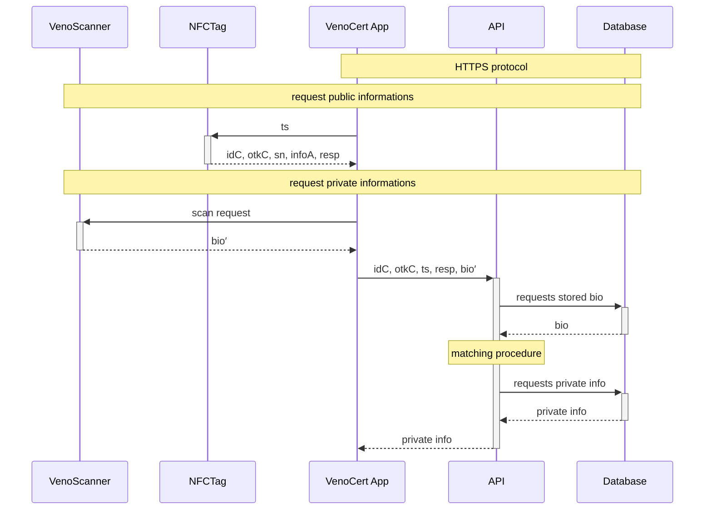

# App's workflow

```mermaid
sequenceDiagram
participant vs as VenoScanner
participant tag as NFCTag
participant app as VenoCert App
participant api as API
participant db as Database

note over app, db: HTTPS protocol

note over vs, db: request public informations

app ->>+ tag: ts
tag -->>- app: idC, otkC, sn, infoA, resp

note over vs, db: request private informations

app ->>+ vs: scan request
vs -->>- app: bio′

app ->>+ api: idC, otkC, ts, resp, bio′
api ->>+ db: requests stored bio
db -->>- api: bio

note over api: matching procedure

api ->>+ db: requests private info
db -->>- api: private info

api -->>- app: private info
```
