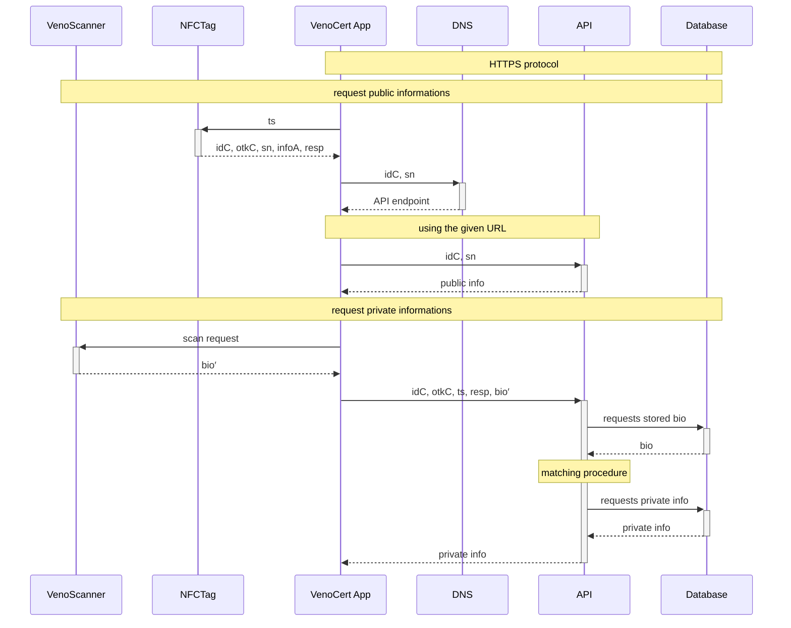

# App's workflow

```mermaid
sequenceDiagram
participant vs as VenoScanner
participant tag as NFCTag
participant app as VenoCert App
participant dns as DNS
participant api as API
participant db as Database

note over app, db: HTTPS protocol

note over vs, db: request public informations

app ->>+ tag: ts
tag -->>- app: idC, otkC, sn, infoA, resp

app ->>+ dns: idC, sn
dns -->>- app: API endpoint

note over app, api: using the given URL
app ->>+ api: idC, sn
api -->>- app: public info

note over vs, db: request private informations

app ->>+ vs: scan request
vs -->>- app: bio′

app ->>+ api: idC, otkC, ts, resp, bio′
api ->>+ db: requests stored bio
db -->>- api: bio

note over api: matching procedure

api ->>+ db: requests private info
db -->>- api: private info

api -->>- app: private info
```
