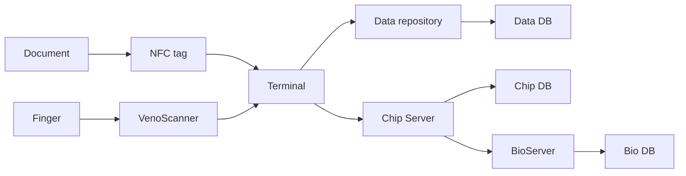
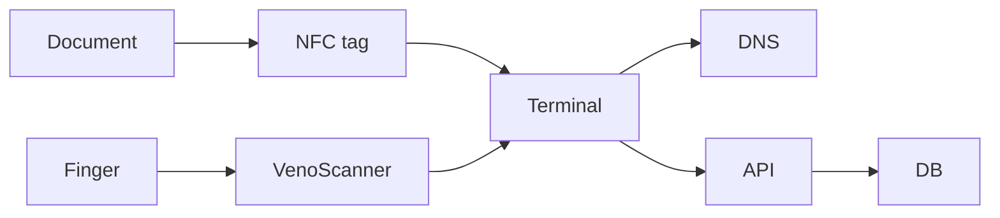

#  Project's architecture

## VenoCert's architecture

```mermaid
graph LR

A[Document] --> B[NFC tag]
C[Finger] --> D[VenoScanner]

B --> E[Terminal]
D --> E

E --> F[Data repository]
F --> G[Data DB]

E --> H[Chip Server]
H --> I[Chip DB]

H --> J[BioServer]
J --> K[Bio DB]
```

## App's architecture

```mermaid
graph LR

A[Document] --> B[NFC tag]
C[Finger] --> D[VenoScanner]

B --> E[Terminal]
D --> E

E --> F[DNS]

E --> G[API]
G --> H[DB]
```
