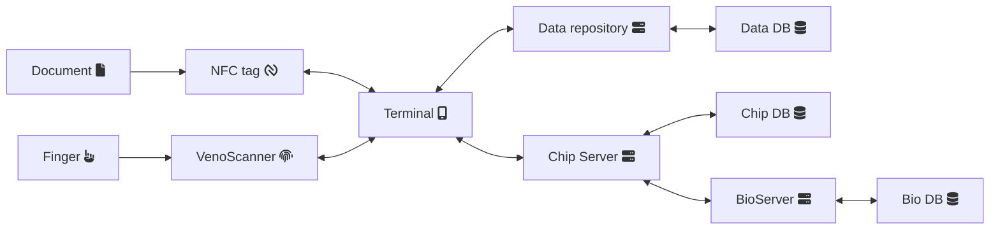
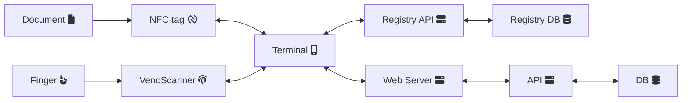

#  Project's architecture

## VenoCert's protocol architecture

```mermaid
flowchart LR
A[Document <i class="fa-solid fa-file"></i>] --> B[NFC tag <i class="fa-brands fa-nfc-symbol"></i>]
C[Finger <i class="fa-solid fa-hand-point-up"></i>] --> D[VenoScanner <i class="fa-solid fa-fingerprint"></i>]

B <--> E[Terminal <i class="fa-solid fa-mobile-screen"></i>]
D <--> E
E <--> F[Data repository fa:fa-server]
F <--> G[Data DB fa:fa-database]

E <--> H[Chip Server fa:fa-server]
H <--> I[Chip DB fa:fa-database]

H <--> J[BioServer fa:fa-server]
J <--> K[Bio DB fa:fa-database]
```

## VenoCert's app architecture

```mermaid
graph LR

A[Document <i class="fa-solid fa-file"></i>] --> B[NFC tag <i class="fa-brands fa-nfc-symbol"></i>]
C[Finger <i class="fa-solid fa-hand-point-up"></i>] --> D[VenoScanner <i class="fa-solid fa-fingerprint"></i>]

B <--> E[Terminal <i class="fa-solid fa-mobile-screen"></i>]
D <--> E

E <--> F[Registry API fa:fa-server]
F <--> J[Registry DB fa:fa-database]

E <--> G[Web Server fa:fa-server]
G <--> H[API fa:fa-server]
H <--> I[DB fa:fa-database]
```
